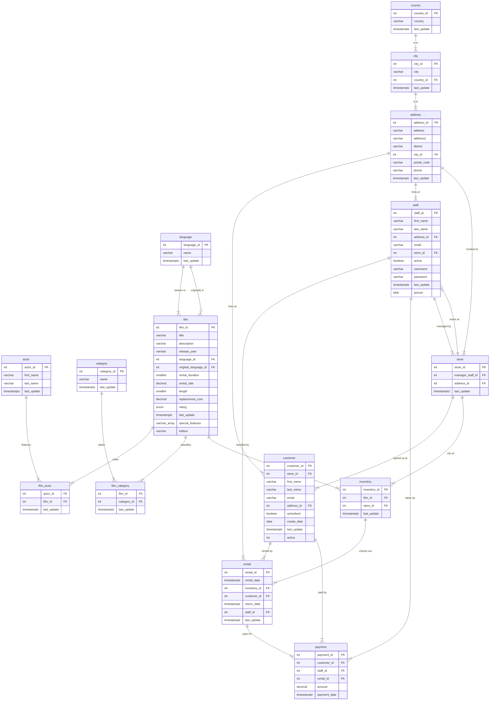

<!-- audience: external -->
# Pagila schema diagram (ERD)

This is the entity-relationship diagram for the film-rental source used in Module 5,
generated from the pinned `pagila.duckdb` release asset itself
(release [`pagila-3.0.0`](https://github.com/Business-Analytics-at-Gies/badm554-data/releases/tag/pagila-3.0.0),
SHA-256 `9deae7bf23f5e73aece8d9afa79b3772ac312f0e3b9db528dfdd127bdb5c3453`), so every
table and column below exists in the file you download. All fifteen tables are shown.
`PK` marks a primary key, `FK` a foreign key. Crow's-foot notation: the `||` side is
the "one", the `{` side is the "many".

## How to view it

- **Right here on GitHub.** GitHub renders the diagram below natively. No install.
- **In VS Code.** Clone this repository and open this file, then install the
  *Markdown Preview Mermaid Support* extension (`bierner.markdown-mermaid`) and press
  `Cmd+Shift+V` (macOS) or `Ctrl+Shift+V` (Windows) for the rendered preview:

  ```bash
  git clone https://github.com/Business-Analytics-at-Gies/badm554-data.git
  cd badm554-data
  code docs/pagila-erd.md
  ```

Reading tip: start at `rental`, in the middle of the action. A rental does not point at
a film. It points at the physical copy (`inventory`), and the copy points at the film.
That two-hop path is the join the schema exists to teach.

One data note repeated from the main README: this build ships 1,500 staff rows and 500
stores, not the two and two of the original Sakila. Write queries accordingly.


